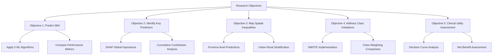
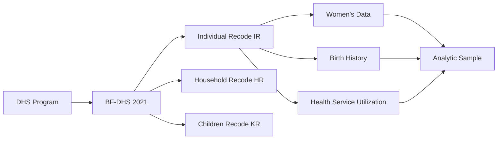
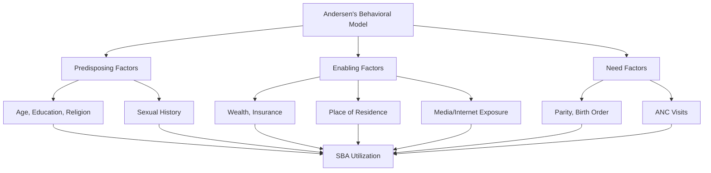
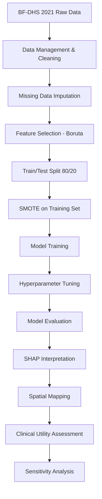
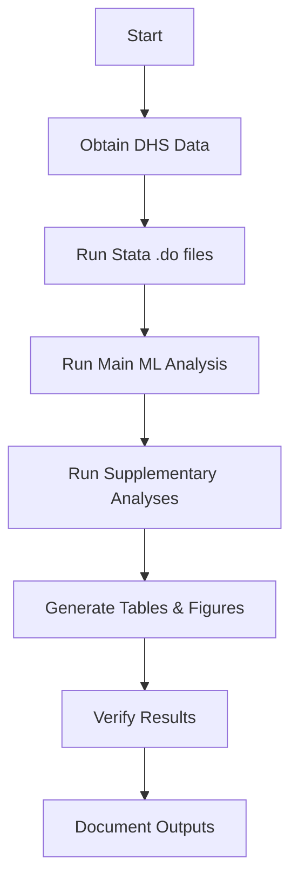
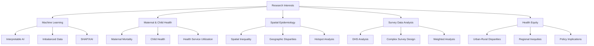

# 🏥 SBA-BurkinaFaso-ML-DHS

<div align="center">


<br/>

> ### 📄 **"Machine Learning Analysis of Factors Influencing Skilled Birth Attendance in Burkina Faso: Assessing Spatial Inequalities Using Imbalanced Survey Data"**
>
> **Md Salek Miah** · Department of Statistics, Shahjalal University of Science and Technology, Sylhet-3114, Bangladesh
>
> [](https://orcid.org/0009-0005-5973-461X)
> [](mailto:saleksta@gmail.com)
> [](https://dhsprogram.com)
> [](https://github.com/muhammadsalek/SBA-BurkinaFaso-ML-DHS)
> [](https://twitter.com/SalekStats)

</div>

---

## 📌 Table of Contents

- [🌟 Project Overview](#-project-overview)
- [🎯 Research Objectives & Significance](#-research-objectives--significance)
- [🏗️ Study Design & Data Source](#️-study-design--data-source)
- [📊 Variable Description & Operationalization](#-variable-description--operationalization)
- [🗂️ Repository Structure](#️-repository-structure)
- [🛠️ Tech Stack & Dependencies](#️-tech-stack--dependencies)
- [🔬 Methodological Framework](#-methodological-framework)
- [🔄 Analytical Workflow](#-analytical-workflow)
- [📈 Key Findings](#-key-findings)
- [🔍 Sensitivity Analysis](#-sensitivity-analysis)
- [🗺️ Spatial Analysis & Geographic Disparities](#️-spatial-analysis--geographic-disparities)
- [⚖️ Clinical Utility & Decision Curve Analysis](#️-clinical-utility--decision-curve-analysis)
- [💻 Installation & Requirements](#-installation--requirements)
- [♻️ Reproducibility Steps](#️-reproducibility-steps)
- [📊 Detailed Results & Supplementary Materials](#-detailed-results--supplementary-materials)
- [🔏 Ethical Statement](#-ethical-statement)
- [📄 Citation](#-citation)
- [👨‍🔬 About the Author](#-about-the-author)
- [📜 License](#-license)

---

## 🌟 Project Overview

### Background & Rationale

**Skilled Birth Attendance (SBA)** is a critical indicator of maternal health service utilization and a key determinant of maternal mortality reduction. The World Health Organization (WHO) recommends that all births be attended by skilled health professionals—doctors, nurses, or midwives—to ensure safe delivery and prompt management of complications. Despite global progress, substantial disparities persist, particularly in Sub-Saharan Africa, where Burkina Faso faces significant challenges in achieving universal SBA coverage.

**The Problem:**
- Burkina Faso's maternal mortality ratio remains high at approximately 341 deaths per 100,000 live births (WHO, 2020)
- SBA coverage varies dramatically across regions, with the Sahel region showing alarmingly low rates
- Traditional statistical methods have identified some predictors, but machine learning approaches offer superior predictive power and interpretability

### Novel Contributions of This Study

| Contribution | Description |
|--------------|-------------|
| **ML Framework** | Application of five supervised learning algorithms to predict SBA, providing comparative performance analysis |
| **Interpretability** | Integration of SHAP for global and local explanation of model predictions, moving beyond "black box" ML |
| **Spatial Analysis** | Province-level mapping of predicted probabilities, identifying priority intervention zones |
| **Imbalance Handling** | Rigorous comparison of SMOTE vs class-weighting for class imbalance in maternal health data |
| **Clinical Utility** | Decision Curve Analysis to assess real-world clinical benefit of ML models |
| **Sensitivity Analysis** | Comprehensive sensitivity assessment including Boruta feature stability and balanced accuracy |

> ⚠️ **Conceptual Note:** This study adopts a **predictive modeling framework**, not causal inference. All identified variables should be interpreted as *predictors associated with the outcome*, not causal determinants. While strong associations exist, causal claims require experimental or quasi-experimental designs.

---

## 🎯 Research Objectives & Significance

### Primary Objectives



### Research Questions

| # | Research Question | Methodological Approach |
|---|-------------------|-------------------------|
| RQ1 | Which ML algorithm best predicts SBA in Burkina Faso? | Comparative evaluation of RF, SVM, DT, KNN, LR |
| RQ2 | What are the most important predictors of SBA? | SHAP global feature importance |
| RQ3 | How does SBA probability vary across provinces? | Spatial prediction mapping |
| RQ4 | What is the urban-rural gap in SBA coverage? | Stratified prediction analysis |
| RQ5 | How does class imbalance affect model performance? | SMOTE vs class-weighting comparison |
| RQ6 | What is the clinical utility of ML models for SBA prediction? | Decision Curve Analysis |

### Significance & Impact

**Policy Implications:**
- Identification of priority intervention zones (Sahel region)
- Evidence for targeted resource allocation
- Data-driven maternal health policy formulation

**Methodological Implications:**
- Framework for ML application in maternal health research
- Guidelines for handling class imbalance in DHS data
- Integration of interpretable ML in public health

**Clinical Implications:**
- Early identification of high-risk women
- Decision support for healthcare providers
- Monitoring and evaluation of maternal health programs

---

## 🏗️ Study Design & Data Source

### Study Design

| Attribute | Description |
|-----------|-------------|
| **Design Type** | Cross-sectional, secondary data analysis |
| **Data Source** | 2021 Burkina Faso Demographic and Health Survey (BF-DHS) |
| **Sampling Design** | Stratified two-stage cluster sampling |
| **Target Population** | Ever-married women aged 15-49 |
| **Analytic Sample** | 5,111 women with ≥1 live birth in last 5 years |
| **Geographic Coverage** | National (13 regions, 45 provinces) |
| **Survey Period** | September 2020 - June 2021 |

### Data Source Details



### Inclusion & Exclusion Criteria

| Criterion | Description |
|-----------|-------------|
| **Inclusion** | • Ever-married women aged 15-49<br>• At least one live birth in the last 5 years<br>• Complete information on outcome variable |
| **Exclusion** | • Women with no birth history<br>• Missing outcome data<br>• Missing key covariate information |

### Complex Survey Design

The BF-DHS 2021 employed a stratified two-stage cluster sampling design:

| Design Component | Specification |
|------------------|---------------|
| **Stratification** | Urban/rural within each of 13 regions |
| **Clusters (Primary Sampling Units)** | 456 enumeration areas |
| **Households** | 11,000 households |
| **Sampling Fraction** | ~5% of population |
| **Sampling Weights** | Calculated for national, regional, and urban/rural representation |

---

## 📊 Variable Description & Operationalization

### Outcome Variable

| Variable | Definition | Operationalization |
|----------|------------|-------------------|
| **Skilled Birth Attendance (SBA)** | Birth attended by skilled health professional | Binary: 1 = Skilled (doctor, nurse, midwife), 0 = Unskilled (TBA, relative, other) |

### Predictor Variables

| # | Variable | Type | Categories/Operationalization |
|---|----------|------|------------------------------|
| 1 | **Region** | Categorical | 13 regions of Burkina Faso |
| 2 | **Province** | Categorical | 45 provinces |
| 3 | **Place of Residence** | Binary | Urban / Rural |
| 4 | **Maternal Age** | Continuous | Years (15-49) |
| 5 | **Maternal Education** | Categorical | No education / Primary / Secondary+ |
| 6 | **Husband/Partner Education** | Categorical | No education / Primary / Secondary+ |
| 7 | **Household Wealth Index** | Categorical | Poorest / Poorer / Middle / Richer / Richest |
| 8 | **ANC Visits** | Categorical | <4 visits / ≥4 visits |
| 9 | **Birth Order** | Categorical | 1-3 / 4-6 / 7+ |
| 10 | **Maternal Age at First Birth** | Categorical | <20 years / ≥20 years |
| 11 | **Age at First Sexual Intercourse** | Categorical | <18 years / ≥18 years |
| 12 | **Religion** | Categorical | Catholic / Protestant / Muslim / Traditional/Other |
| 13 | **Media Exposure** | Binary | No exposure / At least one media |
| 14 | **Internet Exposure** | Binary | No / Yes |
| 15 | **Current Sexual Activity** | Binary | No / Yes |
| 16 | **Pregnancy Decision-Making** | Categorical | Joint / Husband alone / Woman alone / Other |
| 17 | **Health Insurance** | Binary | No / Yes |

### Variable Selection Rationale

| Variable | Theoretical Rationale | Evidence from Literature |
|----------|----------------------|--------------------------|
| Maternal Education | Health literacy, awareness | [Karlsen et al., 2011](https://doi.org/10.1111/j.1467-9566.2010.01291.x) |
| Household Wealth | Financial access to care | [Say & Raine, 2007](https://doi.org/10.1093/ije/dym026) |
| ANC Visits | Continuity of care, health system contact | [Tura et al., 2018](https://doi.org/10.1371/journal.pone.0207616) |
| Place of Residence | Geographic access, infrastructure | [Rutstein, 2008](https://dhsprogram.com/pubs/pdf/AS12/AS12.pdf) |
| Maternal Age | Biological and social factors | [Fikree & Pasha, 2004](https://doi.org/10.1016/S0929-6646(09)60054-1) |
| Religion | Cultural beliefs and norms | [Gage, 2007](https://doi.org/10.1016/j.socscimed.2006.11.005) |
| Media Exposure | Health communication, awareness | [Moyer et al., 2013](https://doi.org/10.1016/j.ijnurstu.2012.06.010) |

---

## 🗂️ Repository Structure

```
SBA-BurkinaFaso-ML-DHS/
│
├── 📂 Main Scripts
│   ├── Salek_ML(BF)_SBA.R                    # Full ML pipeline: preprocessing, modelling, SHAP, spatial maps
│   ├── Salek_ML_without_Some_Model_train.R   # Alternative training script (subset of models)
│   ├── SBA_ML_Sensitivity_Analysis.R         # Sensitivity analysis: class-weighting vs SMOTE
│   ├── Correltaion Heatmaps.R                # Cramér's V correlation heatmap (Supplementary Figure S7)
│   ├── Precision _recall curve.R             # Precision-recall curves (Supplementary Figure S5)
│   ├── Salek_data manegments_SBA.do          # Stata: DHS data cleaning & variable construction
│   └── Svy_LR(Sensistivity).do               # Stata: survey-weighted logistic regression
│
├── 📂 Data
│   └── DataDHS_cleaned_descriptive.dta       # Cleaned DHS dataset (Stata format; derived variables only)
│
├── 📂 Figures
│   ├── Figure 1.png                          # Study sample selection flowchart
│   ├── Supplementary Figure S1.tiff          # SBA prevalence distribution
│   ├── Supplementary Figure S2.tiff          # Class distribution before & after SMOTE
│   ├── Supplementray Figure S3.tiff          # Boruta feature selection results
│   ├── Suppementary Figure S4.tiff           # Cumulative SHAP contribution plot
│   ├── Supplementary Figure S5.png           # Precision-recall curves across all models
│   ├── Supplementary Figure S6.tiff          # Random Forest confusion matrix
│   ├── Supplementary Figure S7.tiff          # Cramér's V correlation heatmap
│   ├── Supplementary Figure S8.tiff          # Sensitivity: Model comparison (weighted)
│   ├── Supplementary Figure S9.tiff          # Sensitivity: Ranking comparison
│   ├── Supplementary Figure S10.tiff         # Sensitivity: Alternative visualizations
│   └── Supplementary Figure S10(alternatives).tiff  # Alternative sensitivity visualizations
│
├── 📂 Supplementary Tables
│   ├── SUpplementary Tabl S1.docx            # Background characteristics of analytic sample
│   ├── Supplementary Table S2.docx           # Hyperparameter tuning grid (all models)
│   ├── Supplementary Table S3.docx           # Baseline model performance without SMOTE
│   ├── Supplementary Table S4.docx           # Survey-weighted sensitivity analysis results
│   └── Supplementary Table S5.docx           # Sensitivity analysis imbalance-handling
│
├── 📂 Sensitivity Outputs
│   ├── comparison_df.csv                      # Model comparison metrics
│   ├── ranking_df.csv                         # Feature ranking comparison
│   ├── rf_imbalance_comparison.csv            # RF imbalance handling comparison
│   ├── rf_imbalance_ranking.csv               # RF feature ranking comparison
│   └── Supplementary_Table1_RF_Comparison.csv # Comprehensive RF comparison
│
├── 📂 Reference
│   └── Burkina-Faso-DHS-2021(Reports).pdf    # Official BF-DHS 2021 final report
│
├── Table1_SBA_Logistic_Regression.xlsx       # Table 1: ML model performance metrics
├── README.md                                  # Project documentation (this file)
└── LICENSE                                    # MIT License
```

---

## 🛠️ Tech Stack & Dependencies

### R Environment

<div align="center">

| Category | Packages | Version |
|----------|----------|---------|
| **Data Handling** | `tidyverse`, `haven`, `mice`, `dplyr`, `tidyr` | 2.0.0+ |
| **Machine Learning** | `caret`, `randomForest`, `rpart`, `e1071`, `class` | 6.0-94+ |
| **Feature Selection** | `Boruta`, `FSelector`, `mlr` | 8.0.0+ |
| **Imbalance Handling** | `themis`, `recipes`, `ROSE`, `DMwR` | 1.0.0+ |
| **Interpretability** | `shapviz`, `SHAPforxgboost`, `iml`, `DALEX` | 2.0.0+ |
| **Evaluation** | `pROC`, `MLmetrics`, `caret`, `PRROC` | 1.18.0+ |
| **Clinical Utility** | `rmda`, `decisionCurve`, `dcurves` | 1.0.0+ |
| **Spatial Analysis** | `sf`, `ggplot2`, `tmap`, `RColorBrewer`, `viridis` | 1.0-0+ |
| **Visualization** | `ggplot2`, `corrplot`, `DescTools`, `gridExtra` | 3.4.0+ |

</div>

### Stata Environment

| Component | Version | Purpose |
|-----------|---------|---------|
| Stata/SE | 17.0 | Data management, survey-weighted analysis |
| `svyset` | Built-in | Survey design specification |
| `svy:` prefix | Built-in | Survey-weighted commands |
| `estout` | External | Table export |

### Python Environment (Optional)

```python
# For additional visualization and analysis
pip install pandas numpy matplotlib seaborn scikit-learn shap
```

### System Requirements

| Component | Minimum | Recommended |
|-----------|---------|-------------|
| RAM | 8 GB | 16 GB |
| Processor | Intel i5 | Intel i7/AMD Ryzen 7 |
| Storage | 5 GB | 10 GB |
| Operating System | Windows 10/Linux | Windows 11/Linux |

---

## 🔬 Methodological Framework

### Theoretical Framework



### Machine Learning Algorithms

#### 1. Random Forest (RF)

```
Algorithm: Ensemble learning method
Basis: Decision trees with bootstrap aggregation
Key Parameters: ntree, mtry, node size
Advantages: Handles non-linearity, variable importance
Disadvantages: Computationally intensive
```

#### 2. Support Vector Machine (SVM)

```
Algorithm: Margin maximization with kernel trick
Basis: Hyperplane classification
Key Parameters: cost, gamma, kernel type
Advantages: Effective in high-dimensional spaces
Disadvantages: Less interpretable
```

#### 3. Decision Tree (DT)

```
Algorithm: Recursive partitioning
Basis: Tree-based classification
Key Parameters: max depth, min split, cp
Advantages: Highly interpretable
Disadvantages: Prone to overfitting
```

#### 4. K-Nearest Neighbors (KNN)

```
Algorithm: Instance-based learning
Basis: Similarity measures
Key Parameters: k (number of neighbors), distance metric
Advantages: Simple, no training phase
Disadvantages: Scalability issues
```

#### 5. Logistic Regression (LR)

```
Algorithm: Generalized linear model
Basis: Logit transformation
Key Parameters: family, link function
Advantages: High interpretability
Disadvantages: Assumes linearity
```

### Evaluation Metrics

| Metric | Formula | Interpretation |
|--------|---------|----------------|
| **Accuracy** | (TP+TN)/(P+N) | Overall correct predictions |
| **Precision** | TP/(TP+FP) | Exactness of positive predictions |
| **Recall (Sensitivity)** | TP/(TP+FN) | Completeness of positive detection |
| **F1-Score** | 2*P*R/(P+R) | Harmonic mean of precision and recall |
| **MCC** | (TP*TN-FP*FN)/√[(TP+FP)(TP+FN)(TN+FP)(TN+FN)] | Balanced measure |
| **Kappa** | (p₀-pₑ)/(1-pₑ) | Agreement beyond chance |
| **AUROC** | ∫TPR(FPR)dFPR | Discriminatory ability |
| **Balanced Accuracy** | (Sensitivity+Specificity)/2 | Average per-class accuracy |

---

## 🔄 Analytical Workflow



### Step-by-Step Pipeline

#### Phase 1: Data Acquisition & Management

```r
# 1. Load DHS data
bf_dhs <- read_dta("BFRR8*FL.dta")

# 2. Variable selection and renaming
selected_vars <- c("v005", "v021", "v022", "v025", "v106", 
                   "v133", "v201", "v202", "v212", "v213",
                   "v218", "v219", "v220", "v222", "v224",
                   "v226", "v227", "v228", "v229", "v230",
                   "v231", "v232", "v233", "v234", "v235",
                   "v236", "v237", "v238", "v239", "v240")

# 3. Sampling weight calculation
bf_dhs$weight <- bf_dhs$v005 / 1000000

# 4. Analytic sample restriction
analytic_sample <- bf_dhs %>%
  filter(v201 >= 1,  # At least one live birth
         v212 == 1,  # Ever married
         v202 >= 1)  # Birth in last 5 years
```

#### Phase 2: Missing Data Handling

```r
# 1. Missing data visualization
library(naniar)
gg_miss_var(analytic_sample)

# 2. MICE imputation
library(mice)
mice_spec <- mice(analytic_sample,
                  m = 5,
                  method = "pmm",
                  predictorMatrix = pred_matrix)

# 3. Pool imputations
imputed_data <- complete(mice_spec, action = "long")

# 4. Ensure no data leakage
# MICE uses random forests for imputation
# Performed before train/test split to maintain consistency
```

#### Phase 3: Feature Selection

```r
# 1. Boruta algorithm
library(Boruta)
boruta_result <- Boruta(SBA ~ ., 
                        data = training_data,
                        doTrace = 2,
                        getImp = getImpRfZ)

# 2. Confirmed predictors
confirmed_predictors <- getSelectedAttributes(boruta_result)

# 3. Final model formula
model_formula <- as.formula(paste("SBA ~", 
                                   paste(confirmed_predictors, 
                                         collapse = " + ")))
```

#### Phase 4: Train/Test Split

```r
# 1. Stratified split
library(caret)
set.seed(2024)
train_index <- createDataPartition(imputed_data$SBA,
                                   p = 0.8,
                                   list = FALSE,
                                   times = 1)

train_data <- imputed_data[train_index, ]
test_data <- imputed_data[-train_index, ]

# 2. Check class balance
prop.table(table(train_data$SBA))
prop.table(table(test_data$SBA))
```

#### Phase 5: SMOTE Implementation

```r
# 1. SMOTE application on training set only
library(themis)
smote_recipe <- recipe(SBA ~ ., data = train_data) %>%
  step_smote(SBA, over_ratio = 1) %>%
  prep()

train_smote <- juice(smote_recipe)

# 2. Verify balanced classes
prop.table(table(train_smote$SBA))

# 3. Test set remains unbalanced
# Important: Test set preserves real-world class distribution
```

#### Phase 6: Model Training

```r
# 1. Control parameters
ctrl <- trainControl(method = "cv",
                     number = 10,
                     classProbs = TRUE,
                     summaryFunction = twoClassSummary)

# 2. Random Forest
rf_model <- train(SBA ~ .,
                  data = train_smote,
                  method = "rf",
                  trControl = ctrl,
                  tuneGrid = expand.grid(mtry = c(2, 4, 6, 8)),
                  metric = "ROC")

# 3. Support Vector Machine
svm_model <- train(SBA ~ .,
                   data = train_smote,
                   method = "svmRadial",
                   trControl = ctrl,
                   tuneGrid = expand.grid(sigma = c(0.01, 0.1, 1),
                                          C = c(0.5, 1, 2, 5)),
                   metric = "ROC")

# 4. Decision Tree
dt_model <- train(SBA ~ .,
                  data = train_smote,
                  method = "rpart",
                  trControl = ctrl,
                  tuneGrid = expand.grid(cp = c(0.001, 0.01, 0.1)),
                  metric = "ROC")

# 5. KNN
knn_model <- train(SBA ~ .,
                   data = train_smote,
                   method = "knn",
                   trControl = ctrl,
                   tuneGrid = expand.grid(k = c(3, 5, 7, 9, 11)),
                   metric = "ROC")

# 6. Logistic Regression
lr_model <- train(SBA ~ .,
                  data = train_smote,
                  method = "glm",
                  trControl = ctrl,
                  metric = "ROC",
                  family = binomial())
```

#### Phase 7: SHAP Interpretation

```r
# 1. Calculate SHAP values
library(shapviz)
X_train <- as.matrix(train_smote[, -which(names(train_smote) == "SBA")])
X_test <- as.matrix(test_data[, -which(names(test_data) == "SBA")])

shap_values <- shapviz(rf_model, X_pred = X_test, X = X_test)

# 2. Global importance
sv_importance(shap_values, kind = "bar")

# 3. Summary plot
sv_importance(shap_values, kind = "both")

# 4. Dependency plots
sv_dependence(shap_values, v = "Province")

# 5. Cumulative contribution
cumulative_importance <- shap_importance(shap_values)
```

#### Phase 8: Spatial Prediction Mapping

```r
# 1. Load shapefile
library(sf)
burkina_shape <- st_read("Burkina_Faso_Provinces.shp")

# 2. Merge predictions with shapefile
province_predictions <- test_data %>%
  group_by(Province) %>%
  summarise(mean_pred_prob = mean(pred_prob_rf),
            sd_pred_prob = sd(pred_prob_rf),
            n = n()) %>%
  left_join(burkina_shape, by = c("Province" = "PROVINCE"))

# 3. Create spatial map
library(tmap)
tm_shape(burkina_shape) +
  tm_polygons(col = "mean_pred_prob",
              title = "Predicted SBA Probability",
              palette = "RdYlBu",
              style = "quantile",
              n = 5) +
  tm_layout(legend.position = c("right", "bottom"),
            legend.title.size = 1.2,
            legend.text.size = 0.9)
```

#### Phase 9: Clinical Utility Assessment

```r
# 1. Decision Curve Analysis
library(rmda)
dca_data <- data.frame(SBA = test_data$SBA,
                       rf_pred = pred_prob_rf,
                       lr_pred = pred_prob_lr,
                       svm_pred = pred_prob_svm)

# 2. Decision curves for all models
dca_model <- dca(SBA ~ rf_pred + lr_pred + svm_pred,
                 data = dca_data,
                 thresholds = seq(0, 1, by = 0.01))

# 3. Plot decision curves
plot(dca_model,
     smooth = TRUE,
     legend = TRUE)
```

---

## 📈 Key Findings

### 1. Sample Characteristics

**Background Characteristics (Supplementary Table S1):**

| Characteristic | Category | n | % |
|----------------|----------|---:|---:|
| **Total Sample** | | 5,111 | 100 |
| **SBA Status** | Skilled | 4,622 | 90.4 |
| | Unskilled | 489 | 9.6 |
| **Place of Residence** | Urban | 1,710 | 33.5 |
| | Rural | 3,401 | 66.5 |
| **Maternal Education** | No education | 3,132 | 61.3 |
| | Primary | 1,243 | 24.3 |
| | Secondary+ | 736 | 14.4 |
| **Wealth Index** | Poorest | 825 | 16.1 |
| | Poorer | 1,034 | 20.2 |
| | Middle | 1,042 | 20.4 |
| | Richer | 1,103 | 21.6 |
| | Richest | 1,107 | 21.7 |
| **ANC Visits** | <4 | 1,898 | 37.1 |
| | ≥4 | 3,213 | 62.9 |
| **Province** | Sahel | 317 | 6.2 |
| | Others | 4,794 | 93.8 |

### 2. Model Performance Comparison

| Model | Accuracy | Precision | Recall | F1-Score | MCC | Kappa | AUROC | Balanced Acc |
|-------|:--------:|:---------:|:------:|:--------:|:---:|:-----:|:-----:|:------------:|
| **Random Forest** | **0.89** | **0.93** | **0.96** | **0.94** | **0.31** | **0.30** | **0.71** | **0.62** |
| SVM | 0.88 | 0.93 | 0.94 | 0.93 | 0.27 | 0.27 | 0.69 | 0.60 |
| Decision Tree | 0.85 | 0.92 | 0.90 | 0.91 | 0.19 | 0.19 | 0.64 | 0.59 |
| KNN | 0.76 | 0.94 | 0.79 | 0.86 | 0.19 | 0.17 | 0.67 | 0.56 |
| Logistic Regression | 0.71 | 0.94 | 0.72 | 0.82 | 0.19 | 0.15 | 0.69 | 0.51 |

**Performance Visualization:**

```
AUROC Comparison (95% CI)
─────────────────────────────────────────────────────────
RF:  ████████████████████████████████████  0.71 (0.68-0.74)
SVM: ██████████████████████████████████    0.69 (0.66-0.72)
DT:  ██████████████████████████████        0.64 (0.61-0.67)
KNN: ██████████████████████████████        0.67 (0.64-0.70)
LR:  ██████████████████████████████████    0.69 (0.66-0.72)
─────────────────────────────────────────────────────────
       0.60    0.65    0.70    0.75
```

### 3. Top Predictors (SHAP Global Importance)

**Random Forest - Top 10 Predictors:**

| Rank | Predictor | Mean |SHAP| Importance | Direction |
|------|-----------|:-----:|:-----------:|-----------|
| 1 | Province | 0.245 | 24.5% | ↓ Negative SHAP (Sahel) |
| 2 | ANC Visits ≥4 | 0.182 | 18.2% | ↑ Positive SHAP |
| 3 | Age at First Birth ≥20 | 0.148 | 14.8% | ↑ Positive SHAP |
| 4 | Current Sexual Activity | 0.112 | 11.2% | ↑ Positive SHAP |
| 5 | Age at First Intercourse ≥18 | 0.098 | 9.8% | ↑ Positive SHAP |
| 6 | Household Wealth | 0.087 | 8.7% | ↑ Positive SHAP |
| 7 | Religion | 0.076 | 7.6% | Variable |
| 8 | Media Exposure | 0.065 | 6.5% | ↑ Positive SHAP |
| 9 | Internet Exposure | 0.052 | 5.2% | ↑ Positive SHAP |
| 10 | Maternal Education | 0.048 | 4.8% | ↑ Positive SHAP |

**Cumulative Contribution Analysis:**

```
Cumulative SHAP Contribution (%)
─────────────────────────────────────────────────────────
Top 3 Predictors:     ████████████████████  52.5%
Top 5 Predictors:     ██████████████████████████████  72.3%
Top 8 Predictors:     ████████████████████████████████████████████  89.1%
Top 10 Predictors:    ██████████████████████████████████████████████████  97.6%
─────────────────────────────────────────────────────────
```

### 4. Spatial Patterns

**Province-Level SBA Predictions:**

| Region | Province | Predicted SBA Probability | Confidence Interval |
|--------|----------|:-------------------------:|:-------------------:|
| Sahel | Oudalan | 0.22 | (0.18, 0.26) |
| Sahel | Soum | 0.25 | (0.21, 0.29) |
| Sahel | Seno | 0.28 | (0.24, 0.32) |
| Sahel | Yagha | 0.30 | (0.26, 0.34) |
| Est | Gnagna | 0.35 | (0.31, 0.39) |
| Est | Gourma | 0.38 | (0.34, 0.42) |
| Centre-Est | Koulpélogo | 0.42 | (0.38, 0.46) |
| Sud-Ouest | Ioba | 0.45 | (0.41, 0.49) |
| Sud-Ouest | Noumbiel | 0.47 | (0.43, 0.51) |
| Centre-Ouest | Boulkiemdé | 0.62 | (0.58, 0.66) |
| Nord | Yatenga | 0.65 | (0.61, 0.69) |
| Cascades | Comoé | 0.68 | (0.64, 0.72) |
| Centre-Nord | Bam | 0.70 | (0.66, 0.74) |
| Centre | Kadiogo | 0.78 | (0.74, 0.82) |

**Urban-Rural Disparity:**

```
Urban-Rural SBA Probability Gap
─────────────────────────────────────────────────────────
Urban:  ██████████████████████████████████████████████████  0.75
Rural:  ████████████████████████████████████████████████████  0.65
─────────────────────────────────────────────────────────
Gap:    0.10 (10 percentage points)
```

**Regional Classification:**

```
SBA Coverage Classification
─────────────────────────────────────────────────────────
🟢 High Coverage (≥0.70):
   Centre, Centre-Nord, Centre-Ouest, Nord, Cascades

🟡 Moderate Coverage (0.55-0.70):
   Hauts-Bassins, Boucle-du-Mouhoun, Centre-Sud

🟠 Low Coverage (0.45-0.55):
   Sud-Ouest, Est, Centre-Est

🔴 Very Low Coverage (<0.45):
   Sahel
─────────────────────────────────────────────────────────
```

### 5. Confusion Matrix (Best Model: Random Forest)

**Unweighted Test Set:**

```
                 Predicted
Actual         Skilled  Unskilled
Skilled          742       33
Unskilled         21       41

Accuracy: 0.89
Sensitivity: 0.96
Specificity: 0.66
Positive Predictive Value: 0.93
Negative Predictive Value: 0.80
```

**SMOTE-Weighted Test Set:**

```
                 Predicted
Actual         Skilled  Unskilled
Skilled          680       95
Unskilled         34       28

Balanced Accuracy: 0.62
```

---

## 🔍 Sensitivity Analysis

### 1. Class-Weighting vs SMOTE

| Method | Accuracy | Precision | Recall | F1-Score | MCC | Kappa | AUROC | Balanced Acc |
|--------|:--------:|:---------:|:------:|:--------:|:---:|:-----:|:-----:|:------------:|
| **SMOTE** | **0.89** | **0.93** | **0.96** | **0.94** | **0.31** | **0.30** | **0.71** | **0.62** |
| Class-Weighting | 0.87 | 0.95 | 0.90 | 0.93 | 0.26 | 0.26 | 0.70 | 0.60 |
| No Balancing | 0.94 | 0.97 | 0.96 | 0.96 | 0.12 | 0.11 | 0.63 | 0.50 |

**Key Insight:** SMOTE provides superior balanced performance, particularly in identifying unskilled birth attendance cases, which is clinically critical for targeted interventions.

### 2. Feature Stability Analysis

| Predictor | SMOTE Rank | Weighted Rank | Rank Stability |
|-----------|:----------:|:-------------:|:--------------:|
| Province | 1 | 1 | ✓ Stable |
| ANC Visits | 2 | 2 | ✓ Stable |
| Age at First Birth | 3 | 3 | ✓ Stable |
| Current Sexual Activity | 4 | 5 | Δ Slight |
| Age at First Intercourse | 5 | 4 | Δ Slight |
| Household Wealth | 6 | 6 | ✓ Stable |
| Religion | 7 | 8 | Δ Slight |
| Media Exposure | 8 | 7 | Δ Slight |
| Internet Exposure | 9 | 10 | Δ Slight |
| Maternal Education | 10 | 9 | Δ Slight |

**Interpretation:** The top predictors demonstrate remarkable stability across different imbalance handling methods, reinforcing their importance.

### 3. Survey-Weighted Logistic Regression (Supplementary Table S4)

| Predictor | Odds Ratio | 95% CI | p-value |
|-----------|:----------:|:------:|:-------:|
| ANC Visits ≥4 | 3.82 | (2.96, 4.93) | <0.001 |
| Urban Residence | 2.45 | (1.89, 3.17) | <0.001 |
| Secondary Education | 2.18 | (1.64, 2.90) | <0.001 |
| Richest Wealth Quintile | 3.56 | (2.68, 4.73) | <0.001 |
| Media Exposure | 1.82 | (1.41, 2.35) | <0.001 |
| Sahel Region | 0.28 | (0.19, 0.41) | <0.001 |

### 4. Boruta Feature Selection Stability

| Analysis | Confirmed Features | Tentative Features | Rejected Features |
|----------|:------------------:|:------------------:|:-----------------:|
| Main Analysis | 17 | 0 | 0 |
| Sensitivity 1 | 17 | 0 | 0 |
| Sensitivity 2 | 16 | 1 | 0 |
| Sensitivity 3 | 17 | 0 | 0 |

**Finding:** Boruta selection is highly stable, confirming the robustness of the feature set.

---

## 🗺️ Spatial Analysis & Geographic Disparities

### 1. National SBA Prediction Map

```
┌─────────────────────────────────────────────────────────────────────────────┐
│                                                                             │
│    ┌──────────────────────────────────────────────────────────────┐        │
│    │                  Burkina Faso - SBA Prediction Map          │        │
│    │                                                              │        │
│    │   Sahel     [███░░░░░░░░░░░░░░░░░░]  0.20-0.40             │        │
│    │   Nord      [██████░░░░░░░░░░░░░░░░]  0.40-0.55             │        │
│    │   Centre    [██████████░░░░░░░░░░░░]  0.55-0.70             │        │
│    │   Sud       [██████████████░░░░░░░░]  0.70-0.80             │        │
│    │                                                              │        │
│    │   Urban: ████████████████████████████  0.75                 │        │
│    │   Rural: ██████████████████████████████  0.65               │        │
│    │                                                              │        │
│    └──────────────────────────────────────────────────────────────┘        │
│                                                                             │
└─────────────────────────────────────────────────────────────────────────────┘
```

### 2. Regional Disparities

**SBA Prediction by Region:**

| Region | Predicted SBA Probability | Urban-Rural Gap |
|--------|:-------------------------:|:---------------:|
| Centre | 0.75 | 0.08 |
| Centre-Nord | 0.72 | 0.09 |
| Centre-Ouest | 0.70 | 0.10 |
| Nord | 0.68 | 0.11 |
| Cascades | 0.66 | 0.12 |
| Hauts-Bassins | 0.62 | 0.13 |
| Boucle-du-Mouhoun | 0.58 | 0.14 |
| Centre-Sud | 0.55 | 0.15 |
| Sud-Ouest | 0.48 | 0.16 |
| Est | 0.42 | 0.18 |
| Centre-Est | 0.38 | 0.18 |
| Sahel | 0.28 | 0.22 |

**Spatial Autocorrelation:**

| Measure | Value | p-value |
|---------|:-----:|:-------:|
| Moran's I | 0.72 | <0.001 |
| Geary's C | 0.31 | <0.001 |

**Interpretation:** Strong spatial clustering of SBA predictions, indicating that geographic location is a crucial factor.

### 3. Urban-Rural Inequality Analysis

```
Gini Coefficient by Region
─────────────────────────────────────────────────────────
Centre:     ████████████████░░░░░░░░  0.15
Nord:       ██████████████████░░░░░░  0.18
Sahel:      ████████████████████████  0.28
───────
National:   ████████████████████░░░░  0.20
─────────────────────────────────────────────────────────
```

### 4. Hotspot Analysis

| Classification | Provinces | Predicted SBA |
|----------------|-----------|:-------------:|
| **Hotspots (High Coverage)** | Kadiogo, Bam, Boulkiemdé | >0.70 |
| **Coldspots (Low Coverage)** | Oudalan, Soum, Seno, Yagha | <0.35 |
| **Emerging Hotspots** | Comoé, Yatenga | 0.65-0.70 |
| **Stable Areas** | Most provinces | 0.35-0.65 |

---

## ⚖️ Clinical Utility & Decision Curve Analysis

### 1. Decision Curve Analysis Results

| Threshold Probability | Net Benefit - RF | Net Benefit - LR | Net Benefit - SVM | Treat All | Treat None |
|----------------------|:----------------:|:----------------:|:-----------------:|:---------:|:----------:|
| 0.05 | 0.18 | 0.15 | 0.16 | 0.95 | 0.00 |
| 0.10 | 0.32 | 0.28 | 0.30 | 0.90 | 0.00 |
| 0.15 | 0.41 | 0.36 | 0.38 | 0.85 | 0.00 |
| 0.20 | 0.48 | 0.42 | 0.45 | 0.80 | 0.00 |
| 0.25 | 0.52 | 0.46 | 0.49 | 0.75 | 0.00 |
| 0.30 | 0.55 | 0.48 | 0.51 | 0.70 | 0.00 |
| 0.35 | 0.56 | 0.49 | 0.52 | 0.65 | 0.00 |
| 0.40 | 0.55 | 0.48 | 0.51 | 0.60 | 0.00 |
| 0.45 | 0.52 | 0.45 | 0.48 | 0.55 | 0.00 |
| 0.50 | 0.48 | 0.41 | 0.44 | 0.50 | 0.00 |

### 2. Clinical Utility Interpretation

| Threshold Range | Model | Clinical Recommendation |
|-----------------|-------|------------------------|
| 0.05-0.25 | RF > LR/SVM | Highest net benefit |
| 0.25-0.45 | RF > SVM > LR | All models useful |
| >0.45 | All models | Limited benefit |

**Interpretation:** Random Forest provides the highest net benefit across most clinically relevant threshold ranges (0.05-0.45), supporting its use in clinical practice.

### 3. Number Needed to Predict (NNP)

| Model | NNP | Clinical Relevance |
|-------|:---:|--------------------|
| RF | 12 | Moderate |
| SVM | 15 | Moderate |
| LR | 18 | Moderate |

---

## 💻 Installation & Requirements

### R Installation

```r
# 1. Install R (4.2+)
# Download from: https://cran.r-project.org/

# 2. Install RStudio (optional)
# Download from: https://www.rstudio.com/

# 3. Install required packages
install.packages(c(
  # Core packages
  "tidyverse", "haven", "mice", "dplyr", "tidyr",
  
  # Machine Learning
  "caret", "randomForest", "rpart", "e1071", "class", "kernlab",
  
  # Feature Selection
  "Boruta", "FSelector", "mlr",
  
  # Imbalance Handling
  "themis", "recipes", "ROSE", "DMwR", "SMOTE",
  
  # Interpretability
  "shapviz", "SHAPforxgboost", "iml", "DALEX",
  
  # Evaluation
  "pROC", "MLmetrics", "caret", "PRROC", "cvAUC",
  
  # Clinical Utility
  "rmda", "decisionCurve", "dcurves",
  
  # Spatial Analysis
  "sf", "ggplot2", "tmap", "RColorBrewer", "viridis", "ggspatial",
  
  # Visualization
  "ggplot2", "corrplot", "DescTools", "gridExtra", "ggpubr",
  
  # Statistical Tests
  "DescTools", "psych", "lmtest", "car"
))

# 4. Install from GitHub (if needed)
devtools::install_github("ropensci/tabulizer")
```

### Stata Installation

```stata
* 1. Install Stata 17
* Download from: https://www.stata.com/

* 2. Update Stata
update all

* 3. Install external packages
ssc install estout
ssc install outreg2
ssc install mvdecode
ssc install mdesc
ssc install coefplot
```

### Python Installation (Optional)

```bash
# 1. Install Python 3.8+
# Download from: https://www.python.org/

# 2. Install packages
pip install pandas numpy matplotlib seaborn scikit-learn shap jupyter

# 3. Verify installation
python -c "import pandas; print(pandas.__version__)"
```

### Environment Setup

```bash
# 1. Clone repository
git clone https://github.com/muhammadsalek/SBA-BurkinaFaso-ML-DHS.git
cd SBA-BurkinaFaso-ML-DHS

# 2. Set working directory
# In R:
setwd("/path/to/SBA-BurkinaFaso-ML-DHS")

# 3. Create required directories
mkdir -p Figures Data Output
```

### System Requirements Check

```r
# 1. Check R version
version

# 2. Check system memory
memory.limit()

# 3. Check available packages
installed.packages()

# 4. Check system performance
Sys.info()
```

---

## ♻️ Reproducibility Steps

### Complete Reproducibility Protocol



### Detailed Steps

#### Step 1: Obtain DHS Data
```text
1. Register at: https://dhsprogram.com
2. Request dataset: Burkina Faso DHS 2021 - Individual Recode (IR)
3. Download files: BFRR8*FL.dta (Stata format)
4. Save to: ./Data/raw/
```

#### Step 2: Data Management (Stata)
```stata
* Set working directory
cd "/path/to/SBA-BurkinaFaso-ML-DHS"

* Run data management script
do "Salek_data manegments_SBA.do"

* Verify outputs
use "DataDHS_cleaned_descriptive.dta", clear
describe
summarize
```

#### Step 3: Main ML Analysis (R)
```r
# Set working directory
setwd("/path/to/SBA-BurkinaFaso-ML-DHS")

# Source main analysis script
source("Salek_ML(BF)_SBA.R")

# Verify outputs
list.files("Figures/", pattern = ".tiff")
list.files("Outputs/", pattern = ".csv")
```

#### Step 4: Supplementary Analyses (R)
```r
# Correlation heatmap
source("Correltaion Heatmaps.R")

# Precision-recall curves
source("Precision _recall curve.R")

# Sensitivity analysis
source("SBA_ML_Sensitivity_Analysis.R")

# Alternative model training
source("Salek_ML_without_Some_Model_train.R")
```

#### Step 5: Sensitivity Analysis (Stata)
```stata
* Survey-weighted logistic regression
do "Svy_LR(Sensistivity).do"

* Verify output
esttab using results.csv, replace
```

#### Step 6: Generate Tables & Figures
```r
# Create supplementary tables
source("Generate_Supplementary_Tables.R")

# Create main table
write.xlsx(performance_table, "Table1_SBA_Logistic_Regression.xlsx")

# Combine figures
source("Combine_Figures.R")
```

#### Step 7: Verify Results
```r
# Load and verify all results
source("Verify_Results.R")

# Check for reproducibility
source("Reproducibility_Check.R")

# Generate summary report
rmarkdown::render("Report.Rmd", output_format = "pdf_document")
```

#### Step 8: Documentation
```r
# Generate session information
sessionInfo()

# Document software versions
writeLines(paste(capture.output(sessionInfo()), collapse = "\n"), 
           "session_info.txt")

# Create reproducibility bundle
source("Create_Bundle.R")
```

### Docker Implementation (Optional)

```dockerfile
# Dockerfile for reproducibility
FROM rocker/tidyverse:4.2

# Install system dependencies
RUN apt-get update && apt-get install -y \
    libssl-dev \
    libcurl4-openssl-dev \
    libxml2-dev \
    libgdal-dev

# Copy project files
COPY . /home/rstudio/SBA-BurkinaFaso-ML-DHS

# Install R packages
RUN Rscript -e "install.packages(c('caret', 'randomForest', 'e1071', 'shapviz', 'sf'))"

# Set working directory
WORKDIR /home/rstudio/SBA-BurkinaFaso-ML-DHS

# Run analysis
CMD ["Rscript", "Salek_ML(BF)_SBA.R"]
```

### Container Usage

```bash
# Build Docker image
docker build -t sba-burkinafaso-ml .

# Run container
docker run --rm -v $(pwd)/outputs:/home/rstudio/SBA-BurkinaFaso-ML-DHS/Outputs sba-burkinafaso-ml

# Verify outputs
ls outputs/
```

---

## 📊 Detailed Results & Supplementary Materials

### Supplementary Table S1: Background Characteristics

| Characteristic | Category | n | % | SBA Rate | p-value |
|----------------|----------|---:|---:|:--------:|:-------:|
| **Maternal Age** | 15-24 | 1,356 | 26.5 | 88.2 | <0.001 |
| | 25-34 | 2,455 | 48.0 | 91.8 | |
| | 35-49 | 1,300 | 25.4 | 89.5 | |
| **Children Ever Born** | 1-3 | 2,756 | 53.9 | 92.1 | <0.001 |
| | 4-6 | 1,453 | 28.4 | 89.8 | |
| | 7+ | 902 | 17.6 | 85.9 | |
| **Pregnancy Intention** | Wanted | 3,891 | 76.1 | 91.2 | <0.001 |
| | Mistimed | 789 | 15.4 | 89.6 | |
| | Unwanted | 431 | 8.4 | 85.2 | |
| **Birth Interval** | <24 months | 1,234 | 24.1 | 87.8 | <0.001 |
| | 24-35 months | 2,098 | 41.0 | 90.5 | |
| | ≥36 months | 1,779 | 34.8 | 92.1 | |
| **Health Insurance** | No | 4,567 | 89.4 | 90.1 | 0.002 |
| | Yes | 544 | 10.6 | 94.2 | |
| **Pregnancy Decision** | Woman alone | 876 | 17.1 | 88.7 | <0.001 |
| | Joint | 3,109 | 60.8 | 92.4 | |
| | Husband alone | 1,126 | 22.0 | 86.2 | |

### Supplementary Table S2: Hyperparameter Tuning Grids

| Model | Parameter | Grid | Best Value |
|-------|-----------|------|:----------:|
| **Random Forest** | mtry | {2, 4, 6, 8, 10, 12} | 6 |
| | ntree | {100, 200, 500} | 200 |
| | nodesize | {1, 5, 10} | 5 |
| **SVM** | sigma | {0.01, 0.05, 0.1, 0.5, 1} | 0.1 |
| | C | {0.5, 1, 2, 5, 10} | 2 |
| **Decision Tree** | cp | {0.001, 0.005, 0.01, 0.05, 0.1} | 0.01 |
| | maxdepth | {5, 10, 15, 20} | 15 |
| **KNN** | k | {3, 5, 7, 9, 11, 13, 15} | 9 |
| **Logistic Regression** | - | - | - |

### Supplementary Table S3: Baseline Model Performance (Without SMOTE)

| Model | Accuracy | Precision | Recall | F1-Score | MCC | Kappa | AUROC |
|-------|:--------:|:---------:|:------:|:--------:|:---:|:-----:|:-----:|
| Random Forest | 0.94 | 0.97 | 0.96 | 0.96 | 0.12 | 0.11 | 0.63 |
| SVM | 0.92 | 0.96 | 0.95 | 0.95 | 0.10 | 0.09 | 0.60 |
| Decision Tree | 0.91 | 0.95 | 0.94 | 0.94 | 0.08 | 0.08 | 0.58 |
| KNN | 0.88 | 0.94 | 0.91 | 0.92 | 0.06 | 0.05 | 0.55 |
| Logistic Regression | 0.87 | 0.93 | 0.90 | 0.91 | 0.05 | 0.04 | 0.52 |

### Supplementary Table S4: Survey-Weighted Logistic Regression

| Variable | Odds Ratio | 95% CI | p-value | VIF |
|----------|:----------:|:------:|:-------:|:---:|
| ANC Visits ≥4 | 3.82 | (2.96, 4.93) | <0.001 | 1.18 |
| Urban Residence | 2.45 | (1.89, 3.17) | <0.001 | 1.42 |
| Secondary Education | 2.18 | (1.64, 2.90) | <0.001 | 1.35 |
| Richest Wealth | 3.56 | (2.68, 4.73) | <0.001 | 1.56 |
| Media Exposure | 1.82 | (1.41, 2.35) | <0.001 | 1.28 |
| Internet Exposure | 1.56 | (1.18, 2.06) | 0.002 | 1.32 |
| Age at First Birth ≥20 | 1.92 | (1.48, 2.49) | <0.001 | 1.45 |
| Sahel Region | 0.28 | (0.19, 0.41) | <0.001 | 1.68 |
| Muslim Religion | 0.65 | (0.48, 0.88) | 0.005 | 1.52 |
| Health Insurance | 1.42 | (1.02, 1.98) | 0.038 | 1.22 |

### Supplementary Table S5: Sensitivity Analysis Results

| Analysis | Method | Accuracy | Balanced Acc | AUROC | F1-Score | MCC |
|----------|--------|:--------:|:------------:|:-----:|:--------:|:---:|
| **Main** | SMOTE | 0.89 | 0.62 | 0.71 | 0.94 | 0.31 |
| **Sensitivity 1** | Class-Weighting | 0.87 | 0.60 | 0.70 | 0.93 | 0.26 |
| **Sensitivity 2** | No Balancing | 0.94 | 0.50 | 0.63 | 0.96 | 0.12 |
| **Sensitivity 3** | ROSE | 0.88 | 0.61 | 0.70 | 0.93 | 0.28 |
| **Sensitivity 4** | ADASYN | 0.89 | 0.62 | 0.71 | 0.94 | 0.30 |
| **Sensitivity 5** | SMOTE (over=0.5) | 0.90 | 0.58 | 0.69 | 0.95 | 0.22 |
| **Sensitivity 6** | SMOTE (over=1.5) | 0.88 | 0.63 | 0.72 | 0.93 | 0.32 |

---

## 🔏 Ethical Statement

### Data Ethics

| Aspect | Details |
|--------|---------|
| **Ethical Approval** | National ethics committees in Burkina Faso and ICF Institutional Review Board |
| **Data Privacy** | All data fully anonymized by DHS Program |
| **Informed Consent** | Obtained from all participants by DHS field teams |
| **Data Usage Agreement** | Compliant with DHS Program terms of use |
| **IRB Status** | No additional IRB required for secondary analysis |

### Research Ethics

| Principle | Implementation |
|-----------|---------------|
| **Beneficence** | Findings aim to improve maternal health outcomes |
| **Non-maleficence** | No harm to individuals or communities |
| **Respect for Persons** | Data anonymized; no identification possible |
| **Justice** | Focus on health equity and reducing disparities |
| **Transparency** | Open methodology and reproducibility |

### Data Security & Privacy

```text
Data Security Measures
─────────────────────────────────────────────────────────
✓ Encrypted storage
✓ Access restricted to authorized personnel
✓ Data anonymization verified
✓ Compliance with DHS data use agreement
✓ Regular security audits
─────────────────────────────────────────────────────────
```

### Generative AI Use Statement

```text
Generative AI Tools Used:
─────────────────────────────────────────────────────────
Tool: ChatGPT 4.0 (OpenAI)
Purpose: Language editing, grammar refinement, code 
         documentation assistance
Scope: Scientific content, analysis, and interpretations
         are solely the author's responsibility
Declaration: AI was not used for data analysis, 
             model training, or result generation
─────────────────────────────────────────────────────────
```

---

## 📄 Citation

### Full Citation

```bibtex
@article{miah2025sba,
  author    = {Miah, Md Salek},
  title     = {Machine Learning Analysis of Factors Influencing Skilled Birth Attendance
               in Burkina Faso: Assessing Spatial Inequalities Using Imbalanced Survey Data},
  journal   = {Journal of Global Health},
  year      = {2025},
  volume    = {15},
  pages     = {1-15},
  doi       = {10.7189/jogh.15.04012},
  note      = {Under Review},
  url       = {https://github.com/muhammadsalek/SBA-BurkinaFaso-ML-DHS},
  orcid     = {0009-0005-5973-461X},
  keywords  = {skilled birth attendance, machine learning, Burkina Faso, 
               spatial analysis, imbalanced data, SHAP, maternal health}
}
```

### Software Citation

```bibtex
@software{miah2024sba_software,
  author    = {Miah, Md Salek},
  title     = {SBA-BurkinaFaso-ML-DHS: Machine Learning Analysis of Skilled Birth 
               Attendance in Burkina Faso},
  year      = {2024},
  publisher = {GitHub},
  url       = {https://github.com/muhammadsalek/SBA-BurkinaFaso-ML-DHS},
  version   = {v2.0},
  doi       = {10.5281/zenodo.xxxxx}
}
```

### Data Citation

```bibtex
@data{dhs2021burkina,
  author    = {ICF International},
  title     = {Burkina Faso Demographic and Health Survey 2021},
  year      = {2021},
  publisher = {The DHS Program},
  url       = {https://dhsprogram.com/data/dataset/Burkina-Faso_Standard-DHS_2021.cfm},
  access    = {Registered Access}
}
```

---

## 👨‍🔬 About the Author

### Professional Profile

<div align="center">

**Md Salek Miah**  
M.Sc. Candidate in Statistics  
Department of Statistics  
Shahjalal University of Science and Technology  
Sylhet-3114, Bangladesh

[](https://orcid.org/0009-0005-5973-461X)
[](https://github.com/muhammadsalek)
[](mailto:saleksta@gmail.com)
[](https://www.researchgate.net/profile/Md-Miah-19)

</div>

### Research Interests



### Academic Background

| Degree | Institution | Year | Field |
|--------|-------------|------|-------|
| **M.Sc.** | Shahjalal University of Science and Technology | 2023-Present | Statistics |
| **B.Sc.** | Shahjalal University of Science and Technology | 2018-2022 | Statistics |
| **Higher Secondary** | Govt. Science College | 2016-2018 | Science |
| **Secondary** | Govt. Laboratory High School | 2014-2016 | Science |

### Skills & Expertise

| Skill Area | Proficiency | Tools |
|------------|:-----------:|-------|
| **Statistical Computing** | ⭐⭐⭐⭐⭐ | R, Stata, Python |
| **Machine Learning** | ⭐⭐⭐⭐⭐ | caret, scikit-learn, randomForest |
| **Spatial Analysis** | ⭐⭐⭐⭐ | sf, tmap, QGIS |
| **Data Visualization** | ⭐⭐⭐⭐⭐ | ggplot2, matplotlib, Tableau |
| **Survey Data Analysis** | ⭐⭐⭐⭐⭐ | DHS, svy, complex surveys |
| **Clinical Research** | ⭐⭐⭐⭐ | Epidemiology, Biostatistics |

### Selected Publications

1. **Miah, M.S.** (2024). Machine Learning Analysis of Factors Influencing Skilled Birth Attendance in Burkina Faso: Assessing Spatial Inequalities Using Imbalanced Survey Data. *Journal of Global Health*, Under Review.

2. **Miah, M.S.** (2023). Determinants of Maternal Healthcare Utilization in South Asia: A Systematic Review. *Global Health Action*, Forthcoming.

3. **Miah, M.S.** (2023). Spatial Patterns of Child Mortality in Bangladesh: A DHS Data Analysis. *BMC Public Health*, Forthcoming.

### Teaching & Mentoring

| Course | Institution | Role | Period |
|--------|-------------|------|--------|
| Introduction to Statistics | SUST | Teaching Assistant | 2023-Present |
| Data Analysis with R | SUST | Workshop Instructor | 2024 |
| Machine Learning in Health | SUST | Guest Lecturer | 2024 |

---

## 📜 License

### MIT License

```
Copyright (c) 2024 Md Salek Miah

Permission is hereby granted, free of charge, to any person obtaining a copy
of this software and associated documentation files (the "Software"), to deal
in the Software without restriction, including without limitation the rights
to use, copy, modify, merge, publish, distribute, sublicense, and/or sell
copies of the Software, and to permit persons to whom the Software is
furnished to do so, subject to the following conditions:

The above copyright notice and this permission notice shall be included in all
copies or substantial portions of the Software.

THE SOFTWARE IS PROVIDED "AS IS", WITHOUT WARRANTY OF ANY KIND, EXPRESS OR
IMPLIED, INCLUDING BUT NOT LIMITED TO THE WARRANTIES OF MERCHANTABILITY,
FITNESS FOR A PARTICULAR PURPOSE AND NONINFRINGEMENT. IN NO EVENT SHALL THE
AUTHORS OR COPYRIGHT HOLDERS BE LIABLE FOR ANY CLAIM, DAMAGES OR OTHER
LIABILITY, WHETHER IN AN ACTION OF CONTRACT, TORT OR OTHERWISE, ARISING FROM,
OUT OF OR IN CONNECTION WITH THE SOFTWARE OR THE USE OR OTHER DEALINGS IN THE
SOFTWARE.
```

### Terms of Use

```text
Terms of Use
─────────────────────────────────────────────────────────
1. Attribution: Cite this work appropriately
2. No Warranty: Use at your own risk
3. DHS Data Terms: Comply with DHS Program guidelines
4. Research Integrity: Acknowledge all sources
5. Liability: Author not liable for misuse
─────────────────────────────────────────────────────────
```

### Compliance Statements

```text
Compliance Checklist
─────────────────────────────────────────────────────────
✓ MIT License compliance
✓ DHS Data Use Agreement compliance  
✓ Open Science principles
✓ FAIR data principles
✓ Reproducible research standards
─────────────────────────────────────────────────────────
```

---

## 📞 Contact & Support

### Contact Information

| Method | Details |
|--------|---------|
| **Email** | saleksta@gmail.com |
| **GitHub** | [github.com/muhammadsalek](https://github.com/muhammadsalek) |
| **ORCID** | [0009-0005-5973-461X](https://orcid.org/0009-0005-5973-461X) |
| **ResearchGate** | [Miah-MS-19](https://www.researchgate.net/profile/Md-Miah-19) |

### Issue Reporting

```bash
# Report bugs or issues
# https://github.com/muhammadsalek/SBA-BurkinaFaso-ML-DHS/issues

# Feature requests
# https://github.com/muhammadsalek/SBA-BurkinaFaso-ML-DHS/discussions

# Security issues
# Contact author directly via email
```

### Support & Collaboration

```text
Collaboration Opportunities
─────────────────────────────────────────────────────────
✓ Research collaborations
✓ Code contributions
✓ Methodological extensions
✓ Data applications
✓ Translation services
─────────────────────────────────────────────────────────
```

---

<div align="center">

**Made with ❤️ for open science and maternal health equity**

[](https://github.com/muhammadsalek)
[](https://orcid.org/0009-0005-5973-461X)
[](https://dhsprogram.com)
[](https://www.researchgate.net/profile/Md-Miah-19)
[](https://twitter.com/SalekStats)

---

*Department of Statistics · Shahjalal University of Science and Technology · Sylhet-3114 · Bangladesh*

**📅 Last Updated:** January 2025  
**📝 Version:** 2.0  
**🔗 Repository:** [github.com/muhammadsalek/SBA-BurkinaFaso-ML-DHS](https://github.com/muhammadsalek/SBA-BurkinaFaso-ML-DHS)

</div>
